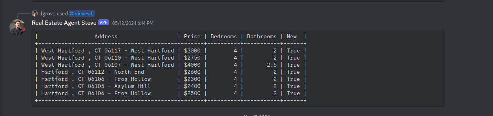
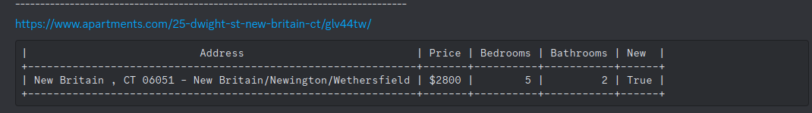

Web scraper and discord bot to show new apartments.com listings.
# Real Estate Agent Steve

## Description of Project
### Project Overview
Real Estate Agent Steve is a Discord bot that was created using the Discord.js library in Typescript. It solved the problem I was facing, where I had to keep checking apartments.com over and over to see if new apartments were listed. I was trying to move into a certain area surrounding my work to cut my commute down, so I made it so you could use the Apartments.com feature to create a certain radius where only apartments within that radius are shown. You can then pass this URL to the environment variables in the program, and Steve will scrape Apartments.com every two hours and save the currently listed apartments into a Sqlite database. Then, every hour, Steve will send you a notification on the Discord channel where you set the details and link to the new apartment. 
### Technologies Used
The list of technologies below are all that were used in the creation of this project.
1. Typescript
2. Discord.js
3. Sqlite
### Interactions
There are two interactions you can have with the discord bot. The first one is the slash command _/view-all_, the second way is with the hourly messages displaying all of the new apartments. Examples of both of these interactions can be seen below.



## Web Scraping Apartment.com
### Details on Web Scraping
Web scraping apartments.com was actually really easy. Due to the ease of creating a radius to scrape from right on their website you can easily scrape all of the listed apartments with their urls. 
```typescript
var apartmentSet = new Set<string>();

root(".property-link").each((i, element) => {
var link = root(element).attr("href");
link ? apartmentSet.add(link) : null;
});
```
This is the code that I used to get all of the links of the apartments. After passing the html into [Cheerio](https://cheerio.js.org/) I was able to easily parse each link. This was more or less the same with the rest of the scraping.

Each Apartments individual page had all of their details in a single table. All you needed to do is scrape from the table.
```typescript
root("ul.priceBedRangeInfo > li.column").each((index, element) => {
      // Extract the label and detail information
      const label = root(element).find(".rentInfoLabel").text().trim();
      const detail = root(element).find(".rentInfoDetail").text().trim();
      // Output the label and detail information
      if (label != "Square Feet") {
        apartment_obj.push({ key: label, value: detail });
      }
    });
```
Since label included the name of the data that was in detail variable I could easily tell what each data point was.
### Saving to Sqlite
I decided to use SQLite as my database of choice for a few reasons. The first reason was that I wanted to limit the number of servers I had to host and SQLite makes it super easy to save all of the data in a static file with the rest of the code for the project. The second reason was due to me being already familiar with SQL and making queries to create and manage the data. Overall SQLite was a simple and easy solution to store the data for retrieval by the Discord bot.

All of my interactions with sqlite were using Buns sqlite libraries. These were really easy to use and implement if you wanted to learn more about buns sqlite libraries they have very good documentation on their [site](https://bun.sh/docs/api/sqlite). 
## Discord Bot Creation
The creation of the discord bot was fairly straightforward following along from the discord.js wiki. There was a few sections that I would like to highlight where I felt like the wiki did not explain in a straight forward way. Hopefully it will help the reader create their own discord bot and not get stuck like I did.

### Sending messages unprompted
I wanted to be able to on a set timer check to see if there was any apartments in the table that were new and send a notification to a discord channel with the details about them. I ran into the problem where most of the documentation was about how to send messages after being prompted by a discord slash command. There however is a way that I found after going though stack overflow questions.

If you want to send a message to a channel you will first need to find the channel id. You can find how to do that on this [wikipedia](https://en.wikipedia.org/wiki/Template:Discord_channel) article. Then you need to follow this code. 
```typescript
const messageChannel = this.channels.cache.get(
      this.messageChannelId ?? ""
    ) as TextChannel;
messageChannel.send("Hello World!");
```

I am assuming you are inside a class inheriting from Client from discord.js


### Register your Slash Commands
For your Discord bot to be able to use your slash commands you need to register them with the guild you are adding it to first. To do this you can follow this [wiki](https://discordjs.guide/creating-your-bot/command-deployment.html#command-registration) from Discord.js. I forgot to do this at first and without it you cannot get your commands to show up in the clients "interactionCreate" event.

## Conclusion
This project helped me develop a further understanding of how typescript works for a non frontend application along with giving me an opportunity to work with Bun and Discord bots for a first time. This is hopefully the first of many projects where I will document how I was able to complete them here on my blog. Hopefully this gave you some incites on how to create a discord bot. This project may have been completed a day after I signed my lease for my new place but it still provided a lot of new knowledge to me on how to create something like this in the future.